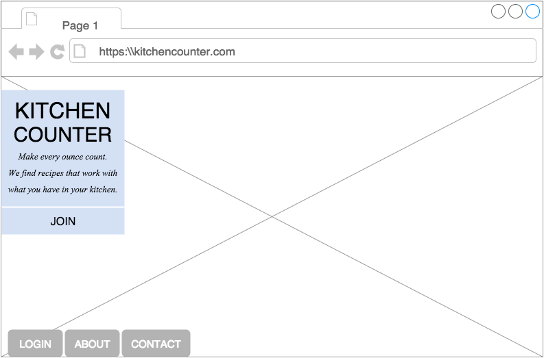
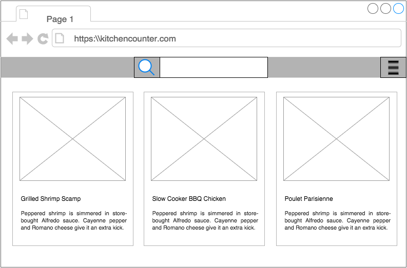
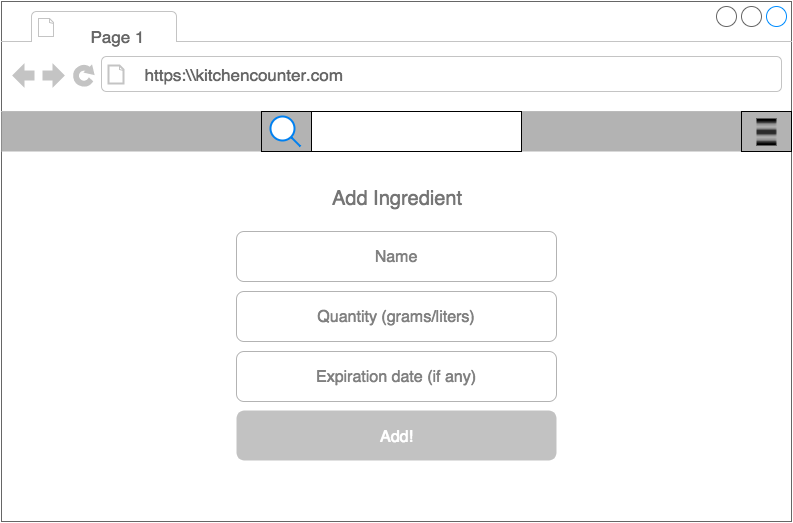

#Kitchen Counter

Never waste food again! Save money by making every last bit of your ingredients "Count!". Not sure what to do with the cayenne pepper in your pantry? Did you forget about the avocadoes in your fruit bowl? Are you overstocked with freezer burnt meat? We'll help you find recipes that make use of ingredients already in your kitchen that have long been forgotten or you just don't know what to do with. 

##Wireframes
- The user's dashboard displays a list of recipes that match 100%, 80% and 50% of the user's ingredients. Here the user can search for recipes, select a recipe, add a recipe and +/- units of existing ingredients or add entirely new ingredients.








##Technologies

- Database: MongoDB
- Web Application Framework: Express.js
- Javascript Framework: Angular JS
- Software Platform: Node.js
- Frontend UI Framework: Bootstrap


##User Stories

- As a user, I want to add ingredients and quantities to my ingredients list so that I can determine what recipes I can cook.
- As a user, I want to add recipes so that I can share with other users.
- As a user, I want to browse recipes so that I can see recipes and highlighted ingredients that match ingredients from my list.
- As a user, I want to view a recipe and it's ingredients with an add button so that I can add this item to my grocery list.
- As a user, I want to check off an instance of a recipe as 'Cooked' so that my ingredients will decrement accordingly.
- As a user, I want to see a list of recipes that match my ingredients 100%, 80% and 50% so that I can determine what to cook.
- As a user, I want to see a list of my ingredients and quantities so that I can know what's in my kitchen if I am grocery shopping.

```
// user schema
var UserSchema	= new Schema({
		fname    		: String
	,	lname    		: String
	,	email    		: { type: String, required: true, unique: true }
	,	password		: { type: String, required: true, select: false }
	,	ingredient	: [{
				name		: String
				, amount	: Number
				, unit		: String //grams or liters
				, expiry	: { type: Date, default: null }
				}]
	, grocery-list		: [ { type: String } ]
});
```
```
// recipe schema
var RecipeSchema	= new Schema({
		title 			: String
	, imageUrl			: String
	,	ingredient  	: [{
					name	: String
				, amount	: Number
				, unit		: String //grams or liters
				}]
	, prep-time			: String
	, cook-time			: String
	, directions		: String
  , user_id      		 : Number //_id of user who created the recipe
});
```
```
Measurements
- grams
- liters

```

###Extras
- Use a barcode scanner to scan products into a user's list of ingredients.
- Track a user's ingredient usage and display visually to user.
- Users can upload their recipe photos to other users' recipes.
- Users can 'favorite' recipes.
- Users can rate other users' recipes.
- Users can comment on other users' recipes.
- Users can receive reminders of items that are soon to expire.
- Users can use the app as a reminder of what is in their stock of ingredients if away from home.
- Users can see previously added ingredients to quickly add to their current list
- As a user, I want to receive email notifications if my ingredient will expire soon so that I am reminded.
- As a user, I want to receive email notifications if my ingredient is running low so that I am reminded.

